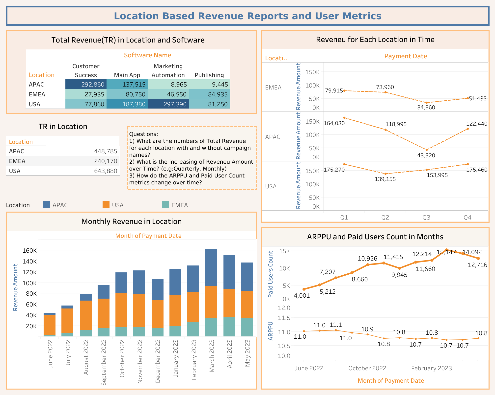

> 📦 A complete SaaS marketing analysis combining SQL, Tableau & Sheets to track revenue, retention and ROI.

This project explores monetization and marketing metrics for a SaaS product.

## 🔍 Key work:

- Analyzed ARPPU (~$11) and MRR growth ($17K → $21K)
- Built dashboards in Google Sheets and Tableau
- Tracked revenue trends and user retention (12.5% by Month 9)
- Used SQL to calculate CPC, CTR, ROAS, ROMI
- Automated weekly reporting to save 30% manual work

**Tools used:** SQL, Tableau, Google Sheets, cohort analysis, marketing analytics

---

## 📊 Dashboards & Analysis Links

- [Location-Based Revenue Reports – Tableau](https://public.tableau.com/app/profile/cem.kahvecioglu/viz/UnitEconomicsSaaSFinancialMetrics/LocationBasedRevenueReportsandUserMetrics)
- [Payment-Based Revenue Reports – Tableau](https://public.tableau.com/app/profile/cem.kahvecioglu/viz/Payment-BasedRevenueReports/PaymentDateReports)
- [Monthly and Product-Based Revenue – Tableau](https://public.tableau.com/app/profile/cem.kahvecioglu/viz/RevenueReports_17492974831360/Dashboard1#1)
- [Conversions Dashboard – Google Sheets](https://docs.google.com/spreadsheets/d/1_ceNWVBsuXzbWSdvaeN4gRUPaifxpr7i7EQ_j3RGzas/edit?gid=1012928360#gid=1012928360)
- [Cohort Retention Analysis – Google Sheets](https://docs.google.com/spreadsheets/d/1PSg_Jr3qz8FUQ5qzf0q-LJ87h20C8p0WM-TvZugrNbg/edit?gid=1608704866#gid=1608704866)

---

## 📷 Sample Dashboard

---

## 🧠 What I Learned

- Applied cohort analysis to uncover long-term retention drop-offs  
- Used SQL window functions to measure month-over-month campaign performance  
- Built and communicated clear, actionable marketing dashboards  
- Practiced combining Tableau, Sheets, and SQL in one data workflow

